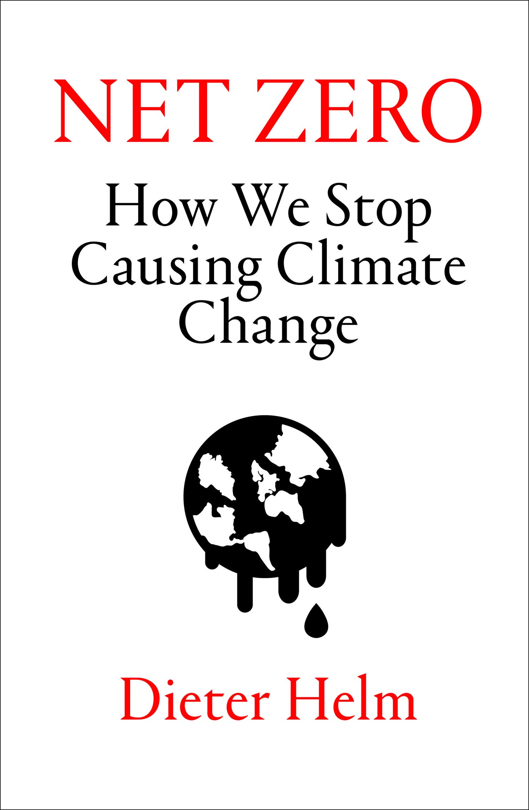

# Net Zero: How We Stop Causing Climate Change

## Dieter Helm

*lu en avril-mai 2021* 

### PART ONE 30 Wasted Years

#### 1 NO PROGRESS

>  What was entirely absent from these groundbreaking global commitments was any sense of what was actually about to happen. The sobering truth is that, since 1990, the world has witnessed the golden age not of renewables but of fossil fuels, the environmental disaster that has accompanied (and been significantly caused by) China’s rapid economic expansion on a scale never previously

emplacement 385-388  

>  Gas was illegal to burn in power stations in the US and Europe until 1990, so it is very much a post-1990 fuel.

emplacement 414-414  

> Gas has been making big inroads as its sheer abundance becomes apparent. It no longer needs to be treated as a premium fuel to be reserved for the higher-value petrochemicals it helps to produce. There is so much gas that its supply is best treated as effectively infinite, and it too is in its golden age.

emplacement 440-442  

> Methane leakage is troublesome because it is a very potent greenhouse gas – up to 80 times worse than CO2 over 20 years,[12] although it does not stay in the atmosphere very long (and methane emissions from agriculture are more significant than those from natural gas).

emplacement 449-452  

>  Chinese economic growth was (and still is) powered by coal, and this translates across to the growth of carbon emissions globally. In the 1990s growth in coal demand was rapid, but then began to level off at around 40 per cent of the world’s primary energy. The chart below illustrates how coal consumption in China accelerated and ultimately exceeded that of the rest of the world. Under

emplacement 453-456  

> More than 90 per cent of these fossil fuels are produced by state-owned companies, and they are going to carry on. Why? Because their economies and their economic growth depend on them, and because they can. Think of Saudi Aramco and its centrality to the Saudi economy. Think of Russia’s Rosneft.

emplacement 486-488  

> **Those who say that this is what is wrong with the ‘capitalist model’ need to consider just what would happen if we jumped off now, rather than over a sensible transition, and why there is no effective carbon price. The statist model is, from a carbon perspective, much worse. It is the work of Saudi Aramco and Rosneft. Climate activists attack European and US politicians and company executives. They don’t dare take on Vladimir Putin, Xi Jinping and Mohammad bin Salman. Gluing yourself to the HQ of Shell or BP is easy: doing it in Moscow, Beijing or Riyadh is much tougher**.

emplacement 490-494  

> emissions are concentrated in a small number of very large sectors, and these feature strongly in China’s growth. China used a lot of cement in its industrialisation and the

emplacement 523-524  

*Renewables – noticeable by their absence*

> For all the media hype about renewables, the important point to make is that they are still an incredibly small part of global energy supplies, to the point of being trivial, as Figure 4 (page 21) shows. The numbers can be made to look much more impressive if the focus is on electricity – in other words, leaving out the use of oil, gas and coal for direct energy supplies, rather than the proportion that goes into generating electricity.

emplacement 560-563  

> These considerations lead to a general conclusion: the cost of energy has fallen for all technologies. There has been little relative gain in costs for renewables.

emplacement 578-580  

> The oil price has maintained a long-term trend, gradually falling in real terms over the period since its inception as an industry in the late nineteenth century, with the exceptional interruptions of the 1970s and in the period running up to the peak in 2014. The renewables

emplacement 580-582  

*The destruction of natural capital*

> Climate change is a two-part act: the natural environment offsets carbon emissions with natural carbon sequestration through trees, vegetation, soils, peat and the marshes and oceans. The story here over the last 30 years is pretty bleak too – and, in a number of cases, because of the climate change policies we have naively been pursuing. 

emplacement 589-591  

> Over the life cycle of the plant, the best that can be achieved is carbon neutrality, but in practice producing biomass emits a lot of carbon. Why? Because not only does the planting and management require energy (and this tends to be tractors and fossil fuel-driven machinery), but it usually displaces something else, and that something else usually sequestrates carbon too. This is why we should be wary of treating ‘bioenergy’ as renewable. Take the disaster that is the explosive 

page 46 | emplacement 605-609  

#### 2 KYOTO AND PARIS

*The appeal to universal interests*

> The trouble with this particular argument and the rationalism on which it is based is that it is not how we humans behave. It is not what makes us human. We are partial, not universal, in our concerns. We do not transfer much of the GDP of developed countries to developing ones. We do not care about starving people in the Sahel as much as we care about our own children, our neighbours and our country. The UK struggles to persuade its voters to transfer just 1 per cent of GDP to those who could use it to much better effect than us – indeed, who could use it to stay alive. **Climate change is partly a moral challenge, but it will not be solved by demanding conduct for which there is no evidence that we will entertain. Saints might, but not the bulk of the population who will be required to pay the costs**.

page 52 | emplacement 692-698  

> Appeals to a wider environmental conscience and for countries to act in mutual global interests – when the national self-interest incentive to free-ride remains – are not working, and they are not going to work. Such appeals make for great political speeches, and UN climate events are full of them. Hot air has so far been spectacularly ineffective, as witnessed by the continuing and relentless rise in carbon concentrations in the

page 53 | emplacement 713-716  

*Measuring emissions*

**You can see where this is going. While we can measure the global concentration of carbon in the atmosphere, and while new satellite technology is getting better at seeing what is going on, it is work-in-progress to measure each country’s emissions.**

*Preventing cheating*

> Subsequently, the UN has tried to tack monetary transfers and funding arrangements onto climate change. So far it has failed, and for two reasons. The rich countries (and their electorates) don’t want to pay up; and there is no credible way to make sure the money is spent on decarbonisation. Indeed, the incentives are even more perverse: Brazil could add to the extortion game by threatening to increase the damage unless the rich countries pay up.

page 55 | emplacement 746-749  

*The UN’s game*

> The positions of the Big 5 are clear: Russia’s elite has some interest in climate change actually happening in the short term, and, as noted, the US is never going to cede sovereignty.

page 57 | emplacement 773-775  

> the US was not about to cede sovereignty to the UN, and not about to find itself paying developing countries to decarbonise. No US president since Clinton has tried, and that is why the Copenhagen COP ended up with the Copenhagen Accord, and why Barack Obama could not sign up to a legally binding treaty at Paris. For all the very different styles and political outlooks, Clinton, George W. Bush, Obama and Trump have all taken the same US position. This is not about to change, and indeed at the time of writing it is being further reinforced by Trump in the run-up to the 2020 election.

page 58 | emplacement 789-793  

*The miracle solution*

> planes, and biofuels and biomass are the future anyway. This is the miracle solution. We can decarbonise and it won’t cost us any more than not decarbonising. Even better, if we don’t decarbonise we will end up with higher costs, because

page 59 | emplacement 804-805  

*Europe takes the lead*

> The need to have Russia on board was all the more pressing because others were dropping out. Two very new countries in emissions terms saw their domestic carbon production rise sharply. Canada bust the limits early on and formally left in 2012, and Japan struggled to comply, and dramatically so after the 2011 Fukushima Daiichi nuclear disaster triggered the closure of all its nuclear power stations, and a dash for coal and gas to fill the gap. Japan was second only to France in terms of the size and share of nuclear in its energy mix. With nuclear gone, it was hopeless to try to meet the Kyoto targets.

page 62 | emplacement 851-855  

*The debacle at Copenhagen*

*The denouement at Paris*

Paris or the continuing UN process. Having failed to secure the legally binding targets, the UN’s climate bureaucracy fell back on a second-best. Instead, the parties would be legally bound to come up with further NDCs by 2020, and these would be compatible with the overall 2°C. It could then be claimed that there was a legally binding agreement, a triumph for Paris. If the current NDCs did not add up, at least there was a pledge to make sure they did in the future.

> page 64 | emplacement 893-896  

#### 3 GOING IT ALONE

*Unilateralism and the incentive problem*  

> Why would the US or China go unilateral? The US has always argued that its actions are conditioned by those of China.

page 67 | emplacement 935-936  

> The trouble with the Europeans pressing the others to fall into line is that Europe has not actually done much to reduce its carbon footprint, despite cutting emissions at home. And much of these cuts would have happened anyway. It is a story of deindustrialisation, and importing

page 68 | emplacement 945-947  

*Unilateralism and morality*

> Take the individual unilateralist position. We could say that each of us should not make climate change worse, and that we have an obligation to make no net carbon emissions, so we are not personally responsible for any further climate change. We should do no harm. The retort that this would make no difference to climate change is an obvious one, and as far as it goes it is true. Just as our individual votes are unlikely to change the outcome of an election, so our emissions are too trivial to impact on the global climate. Under a utilitarian consequentialist view, we should do nothing, and especially if doing something costs us some utility.

page 72 | emplacement 1006-1011  

> Which brings us back to how to shape our individual choices and the no regrets approach, and to encourage others who might not be so altruistic. Imagine if the cost of carbon pollution was paid by the polluter, the infrastructure was provided and paid for, and the investments in R&D for new low-carbon technologies were all funded by the State. Now the prices you face when you go through the choices in your carbon diary are very different. Electricity generated from fossil fuels will be more expensive than the low-carbon options.

page 74 | emplacement 1034-1038  

*Unilateralism in Europe*

> To do this, a new European climate package was eventually agreed in 2007 and translated into a set of unilateral directives in 2009, all with the magic number 20. There would be 20 per cent renewables, a 20 per cent improvement in energy efficiency, and a 20 per cent reduction in total emissions – all by 2020, the Kyoto target date, and all against a 1990 baseline.

page 75 | emplacement 1055-1058  

> not have been difficult, and they made it even easier: **the 20 per cent renewables included biomass, which would become 50 per cent of the renewables energy mix. Since there was a lot of biomass in Europe anyway, and since it would in time include the conversion of large coal stations to burn wood pellets, the 20 per cent was less than it seemed.**

page 75 | emplacement 1060-1062  

*The EU Renewable Energy Directive*

> The Renewable Energy Directive produced a lot of action across Europe.[5] It was a major victory for the wind and solar lobbies, and the rising demand for turbines and solar panels resulted in two developments: the cost of energy increased; and the imports of turbines and panels also increased.

page 76 | emplacement 1067-1070  

> **The IEM spelled death for the renewables. They were not cost-competitive and if customers shopped around they would all be out of the market. They needed state aids and they needed priority access to networks.[7] So while the IEM pushed towards competitive and open markets, the Renewable Energy Directive pointed in the exact opposite direction. The State would provide protected tariffs for reserved market shares, and force customers to pay through their use-of-system charges**.

page 76 | emplacement 1075-1079  

> This protected renewables market provided a great boon to lobbyists and vested interests. All they needed to do was capture the political process and then they would get their preferred technology subsidised and, as it turned out, substantial profits too. Capturing the political process proved easier where mainstream political parties needed to either capture the green votes or go into coalition with green parties (as in Germany).

page 77 | emplacement 1081-1084  

> The reason Denmark could go heavily into intermittent wind was because it could import electricity from the north and spill its surplus wind to the south. To the north it could draw on hydro to balance its system, and there was the large German market to the

page 78 | emplacement 1098-1100  

> **But what is really remarkable about Denmark is that, despite its small size and strategic location, it could not actually reduce its impact on climate change. It turned out that the increase in carbon intensity of its imports more than outweighed the decline in domestic carbon emissions. As a result, it continued to contribute to global warming.**

page 78 | emplacement 1100-1102  

> To address transport, the EU decided to use a mix of emissions standards and a requirement to use a given percentage of biofuels.[9] The result was a misguided dash for diesel and a push towards the production and import of biofuels.

page 78 | emplacement 1105-1107  

> Diesel turned out to create really big problems for air pollution and push a number of cities into violating air quality standards.

page 78 | emplacement 1108-1109  

*The EU Emissions Trading System*

> **The permits could be added to their balance sheets, and they provided a convenient barrier to other potential entrants into their markets.** [...] New carbon trading industry (and hence a new set of vested interests) emerged, profiting from carbon trading. The EU ETS also offered opportunities for corruption and VAT (value-added tax) fraud.[11]

page 79 | emplacement 1128-1131  

> **As a result, the carbon permit price could fall. In effect, the renewables were almost exactly offset by an increase in coal-burn, all courtesy of the EU ETS**.

page 80 | emplacement 1135-1136  

*Deindustrialisation and the UK* 

> whereas a 3 per cent growth in GDP meant a 7 per cent growth in electricity demand from 1945 to 1979, after 1980 this relationship broke down. This decoupling was the result of the changing industrial structure rather than climate change policies. [... ] This matters for the impact of unilateral policies because what Europe did in the last 30 years was create an additional boost to a deindustrialising process already under way. 

page 81 | emplacement 1149-1154  

*The UK’s Climate Change Act*

> The linear approach is sometimes implicitly supported by an additional argument: that there are first-mover advantages from decarbonising on a fast track. 

page 82 | emplacement 1173-1174  

> follows that any loss in output from UK farming resulting from decarbonisation measures is likely to be trivial and lower than for any other area that policies have been directed towards. It is the lowest-cost option and a very low-hanging fruit. Better still, as we shall see

page 84 | emplacement 1196-1198  

> **The UK is not closing existing nuclear power stations; it is building at least one more twin reactor; and it is fast-tracking the closure of coal by 2025, using a unilateral carbon price to help deliver this outcome. Germany is fast-tracking the closure of all existing nuclear, building no more, and slow-tracking the exit from coal. There are clearly better and worse unilateral policies.**

page 84 | emplacement 1203-1205  

*Germany’s Energiewende* 

> **Of all the carbon myths, the presentation of Germany as the great green champion, and the greenest in Europe and indeed the world, is a triumph of spin over substance.**

page 84 | emplacement 1206-1207  

> From all the speeches and media coverage, you might think the Germans are the greenest Europeans, and with one of the strongest green parties in Europe, that their leadership would translate into carbon progress. The German reality is very different and an object lesson to the rest of the world of just how not to do it. As an exemplar, it was intended to show how decarbonisation could be done fast, cheaply and as part of a successful industrial strategy to create world-beating new renewables companies. The results have been almost the exact opposite. It has not decarbonised very much; it has been very expensive; and it has provided an industrial strategy boost for China, not Germany. No developing country would want to follow Germany’s example.

page 84 | emplacement 1207-1212  

> Germany’s unstated strategy was to rely more on coal. This was highly polluting, damaging to human health, and in direct conflict with the 2020 targets.

page 85 | emplacement 1223-1224  

> It is hard to think of a policy that could be worse from a climate change perspective. Not only would the existing coal capacity be kept going, but 13 GW of new coal would be added. Only Japan made a similar disastrous move, but then it had had the Fukushima disaster at home and had shut down more than 50 nuclear reactors.

page 85 | emplacement 1224-1226  

> Yet it has been even worse. **Not only has Germany gone from nuclear to coal, but also from gas to coal. Instead of using gas as a bridge fuel to cheaply displace the coal – and at half the emissions – Germany has done the opposite**. In this, it has been aided by the EU ETS, which set a low carbon price, gave gas little cost advantage over coal and, as noted, enabled the renewables to be offset by coal.

page 86 | emplacement 1232-1234  

### PART TWO The Net Zero Economy

#### 4 LIVING WITHIN OUR ENVIRONMENTAL MEANS

> The climate change problem, like other environmental problems, is the consequence of an unsustainable consumption path. If this is generalised, then it has a much bigger implication: that we are all on an unsustainable growth path. The pursuit of ever-higher GDP, and a belief that growth is maximised by ever-expanding aggregate demand, regardless of the composition of that growth, is what has brought us to the

page 89 | emplacement 1261-1264  

> These are the three general principles of a sustainable economy: **polluter pays; public money for public goods; and net environmental gain**.

page 90 | emplacement 1270-1271  

*The first principle for a sustainable economy: The polluter pays

> Note the word ‘excessive’. The optimal quantity of pollution is rarely zero. To see why this is so, consider a world in which there is zero pollution. It would be a world with very few humans

page 90 | emplacement 1279-1281  

> There is no wild to rewild back to, no primitive and pristine state of nature to which we can aspire.[1] The point is to make our impacts in such ways as to leave the natural world in at least as good a state as we inherited it. We should tread lightly, but nevertheless still tread. This is not and can never be a zero-pollution world. But we have already done enough harm.

page 90 | emplacement 1283-1286  

> carbon price helps with those who are not persuaded to act morally themselves by creating a selfish incentive for them to switch from carbon-intensive goods, not because they necessarily care but rather just because these become more expensive. How to introduce a carbon price is the subject of the next chapter.

page 91 | emplacement 1293-1295  

> The economy would be radically different. Put another way, our current economy is staggeringly inefficient.

page 91 | emplacement 1297-1298  

> **No doubt there is much that these companies can and should do, but they are not the ultimate polluters. It is you and me – and therefore the polluter who should ultimately pay is you and me**. We buy the stuff the companies make for us. We buy the petrol and diesel, the flights, the plastic-wrapped products, and the cardboard boxes that our internet purchases come in. We buy the clothes which are often barely worn before being discarded. It is all the stuff in your carbon diary.

page 92 | emplacement 1307-1310  

> **There will be a radical change in what goes into your shopping trolley. That is all to the good: it is how we shift towards a more sustainable, and efficient, economy. But there is a downside. Your shopping trolley will also be more expensive. Some things will be cheaper than others, but few prices will go down, and most will go up, some by a lot. Why? Because the pollution cost gets added to the other costs, rather than ignored, and that pushes up prices**.

page 93 | emplacement 1327-1330  

> Politicians will have to stop promising a painless transition to a sustainable future, and economists will have to stop telling us that decarbonisation is going to be just a huge economic opportunity, all gain and no pain.

page 94 | emplacement 1336-1337  

> Although there are some merits in a short, very sharp shock, going immediately from the current low prices to prices which properly account for pollution, the medicine might kill the patient. **Those who, for example, advocate getting to net zero by 2025 or 2030 should think hard about just how profound this shock would be, and the risk that it would paralyse economies, throwing people out of work and inducing real hardship.** It might make the economic consequences of Covid-19 look like a picnic.

page 94 | emplacement 1340-1343  

> The obvious risk is that this becomes a downward cycle, with mass unemployment. The voters are likely to revolt.

page 94 | emplacement 1345-1346  

> **whereas many advocates of a ‘green new deal’ want to maintain consumption, paying for investment through borrowing, and not through higher levels of saving. They want aggregate consumption to go up to increase aggregate demand and to decarbonise, and get future people to pay back the debt. [...] What climate change demands is to reduce consumption to a sustainable level and use the savings generated to pay for investment, as in a wartime economy.**

page 95 | emplacement 1364-1367  

*The second principle for a sustainable economy: Public money for public goods*

*The third principle for a sustainable economy: Net environmental gain*

*Delivering a sustainable economy*

> A sustainable economy has to meet intergenerational equity too.[4] It is not just pollution now that counts against efficiency, but also pollution dumped on the next generation. To address this generational point, the sustainable economy needs to meet one further condition: that it passes on to the next generation a set of assets at least as good as those it inherited.

page 101 | emplacement 1452-1456  

> That is what will drive sustainable economic growth. The environmentalists are right to argue that current GDP growth cannot be sustained, but that is because GDP measures the wrong (and often highly polluting) things.[7] There needs to be a rebasing, to a sustainable consumption level, and then growth can continue as ideas, science and technology increase human possibilities.

page 103 | emplacement 1479-1482  

> older socialists see climate change through the prism of their critique of capitalism. Pollution is just a symptom of the capitalist system, which needs to be brought down and replaced by state planning, state investment and state delivery. A confluence of these different environmental–political strands has taken place, and not all of it is going to help achieve an efficient decarbonisation.

page 103 | emplacement 1487-1490  

> It is the next generation, the young, who will get the pollution we are causing now and that we have already caused, and the debts to pay for clearing it up. This hardly fits with intergenerational equity, and it looks worryingly as if the current older generation of polluters is going to get away with it.

page 107 | emplacement 1556-1558  

> It is hard to imagine any coherent decarbonisation strategy without a price of carbon at its core. If something is not priced, the pollution it causes is not taken seriously in everyday decisions by governments, companies and individuals. If the price is zero, or too low to represent the damage being done, there will be over-consumption of the things within which carbon is embedded.

page 110 | emplacement 1606-1609  

> **Arguing that it is all too politically difficult to confront people with the consequences of their pollution is really just saying that decarbonisation is not possible because people want to carry on living beyond their means. Without a carbon price, decarbonisation will almost certainly cost more, and hence be even more painful**.

page 111 | emplacement 1609-1611  

*The ethics of pricing carbon*

*Prices or quantities: the EU ETS versus carbon taxes* 

> Why? Because if the permits are grandfathered (handed out to the polluters at the start of the scheme), the polluters get a free right to pollute and, unlike the tax case, do not have to pay up to the government. They keep the money – what in economics is called the income effect of the carbon price.

page 115 | emplacement 1672-1674  

> volatile and so far pathetically low for most of its history. It has nevertheless helped to protect coal, and in particular in Germany, since more renewables reduce emissions and therefore leave more room for coal. We met this aspect of the Energiewende earlier.

page 115 | emplacement 1681-1683  

> Pretending that decarbonisation is cheap, by hiding behind the subsidies and permits, has the great political merit of disguise.

page 116 | emplacement 1696-1697  

*What price to set*

> Indeed, it does not even require the marginal calculations which are in any event highly suspect for a system problem like climate change. All the work is done in setting the initial targets, and then the carbon price is just the tool to help to achieve them. The market reveals the costs.

page 117 | emplacement 1719-1721  

> An immediately high price will yield lots of money (because people and companies cannot instantly change their capital equipment and just have to pay), but not much in the way of actual carbon reductions. The trick is to start low, but credibly signal that the price is going to go up as high as is necessary to achieve the target.

page 118 | emplacement 1724-1726  

> The credibility of the commitment to ‘do what it takes’ means that the adaptation will ideally happen in advance, and hence the actual tax may not need to be so high. Indeed, if and when net zero is achieved, the price of carbon should in theory be zero.

page 118 | emplacement 1727-1728  

*The domain of the tax and the carbon border price*

> The second objection is that carbon border taxes are impractical. How, it is asked, can the carbon composition of an imported pack of bacon or a tonne of steel or fertiliser be measured? Recall how hard it is for you to fill in your carbon diary, and then imagine doing this for all imports. **The answer is that, on a detailed tonne-by-tonne basis, emissions for each item cannot be quantified**.

page 119 | emplacement 1748-1750  

> Fortunately, this does not much matter. It cannot be done domestically with precision either, and it does not need to be**. Not to have a border tax, while at the same time having a domestic carbon tax, is precisely wrong**. What we want to be is roughly right, to go in the right direction. Practically, the place to start is with the really big carbon imports. Apart from oil, gas and coal, which are relatively easy to measure and tax, the manufactured items that matter are a small number of ubiquitous inputs to domestic production. These include fertilisers, cement, steel, petrochemicals and aluminium (the ‘big 5’). In addition to these, information and communications technology (ICT) is the coming big one, to power all the computing behind our digitalising economies.

page 119 | emplacement 1750-1756  

*Upstream or downstream: where to levy the tax*

*Who fixes the price*

*What to do with the money*

> The classic public finance approach says that taxing and spending are two different activities, and that the Treasury should raise money as efficiently as possible through taxes, and quite separately decide how it is spent.

page 124 | emplacement 1822-1824  

> The carbon tax both reduces aggregate demand and changes the relative prices. The recycling just changes the relative prices, keeping up total spending. 

page 125 | emplacement 1839-1840  

#### 6 NET ZERO INFRASTRUCTURES

*Markets are not enough*

> BT owns lots of copper wire, and these sunk and fixed assets have been charged to pay BT’s dividends and to fund its pension deficit.[1] If you’ve ever wondered why Britain now lags behind many other developed countries on broadband and fibre, this incentive problem is one crucial reason. It is why it is important to split up the company, cordoning off these legacy assets from the roll-out of broadband and fibre.

page 129 | emplacement 1900-1904  

*The centrality of infrastructure networks*

*net zero national infrastructure plan*

*regional and global infrastructure plan*

> Most European countries are connected to their neighbours, with France’s 80 per cent nuclear capacity as a pivotal European supply, especially to anti-nuclear Germany.

page 137 | emplacement 2032-2033  

> As an alternative to electricity transmission, Iceland (geothermal) and Norway (wind) could provide the feedstock for a hydrogen economy through the process of electrolysis. In Iceland, there is potentially almost no limit to the scale with which this could be done. If hydrogen takes off as a viable fuel, initially for the harder-to-reach

page 138 | emplacement 2037-2039  

*System operators and implementing the plans*

> Infrastructure comes in systems. It is not an atomised collection of individual investments, each considered in isolation from the rest. It is therefore not amenable to narrow CBA.

page 139 | emplacement 2055-2056  

*Making it happen*

> Governments need to plan the networks, and the new challenge is to plan these with net zero in mind.

page 142 | emplacement 2110-2111  

> The last 30 wasted years have been characterised not only by the golden age of fossil fuels, but a dark age for infrastructures.

page 142 | emplacement 2112-2113  

#### 7 NATURAL SEQUESTRATION, OFFSETTING, AND CARBON CAPTURE AND STORAGE

*Why offsetting is required*

*Types of sequestration*

> Natural sequestration (and natural emissions) happens all the time. Our interest is in net sequestration, over and above the natural emissions from anything that breathes out carbon, and from the erosion of rocks.

page 145 | emplacement 2154-2156  

> Natural sequestration includes planting additional trees, encouraging the recarbonisation of the soils and the regeneration of peat bogs.

page 146 | emplacement 2160-2161  

> In all cases, the baseline needs to be defined. What is the baseline forestation against which additional trees are planted? What is the soil baseline?

page 146 | emplacement 2165-2166  

> For CCS, consider an oil company that is depleting an oil well. When the well starts producing, the pressure is typically very high. In some cases, it is so high as to risk blowouts, such as the BP Deepwater Horizon disaster in the Gulf of Mexico in 2010. Gradually the pressure drops, and when around half or even less of the oil has been extracted, it is typically so low that the well may be abandoned. Now along comes CCS, and the possibility of getting paid to inject carbon back into this well. Gas is a good way of increasing the pressure again, and hence the oil company could get paid to use the well for CCS, and get the bonus of more oil extracted. The former is a step towards net zero; the latter is not.

page 146 | emplacement 2170-2175  

> This might work out if the carbon tax is set at the right level and applied to the oil extracted. But it would not be a good result if there is no proper carbon price. The key point is that each of our three principles – polluter pays, public infrastructure and public goods, and net gain – have to be applied simultaneously to pursue net zero efficiently, and not in isolation.

page 146 | emplacement 2175-2177  

> The wells themselves are gas-tight (which is why they could be exploited in the first instance), and sealing is a matter of plugging the drill holes that were created in the past. If there is a bit of leakage, as long as it is monitored, it is still a better option than simply venting the carbon to the atmosphere from the power station or large industrial complex. For this reason, if there is anywhere in the world CCS might work, it is in the North Sea, and that is why, for global reasons, it should be tried. It is not, however, going to make a big difference to global warming; nor is it a get-out-of-jail-free card for oil and gas producers, let alone coal producers. The reason is that the volume of the carbon put back as CO2 is typically greater than the volume of carbon extracted, so many more holes are needed than existing wells, and there may not be enough other holes readily available to utilise.

page 147 | emplacement 2184-2190  

*Net zero for companies*

> Thinking about it this way, **it is not clear that there is a sequestration option for our polluter by planting trees. The existing trees should be preserved anyway, regardless of its emissions. New trees should also be planted anyway, regardless of the company’s emissions**.

page 149 | emplacement 2224-2226  

*Offsetting for countries*

> In the economy as a whole there is an offset that helps to meet the overall aggregate net zero emissions target. It is just that it is the government and not the company that has the objective and the legal duty to meet it. Requiring each and every company to offset its emissions is neither necessary nor desirable if each

page 151 | emplacement 2248-2251  

*Net zero for individuals*

*Offsetting markets*

*A great opportunity*

### PART THREE Agriculture, Transport and Electricity  

#### 8 AGRICULTURE: GREEN, PROSPEROUS AND LOW-CARBON

> contributing to, the net zero target needs a lot more thought. The risk is that its two key proposals – more forestry and less meat – provide a narrow carbon focus without considering the wider ramifications, and could even become counterproductive.

page 161 | emplacement 2382-2384  

*The baseline*

*Polluter pays*

> The important point about applying the polluter-pays principle is that agriculture has multiple pollutants. It is not just about carbon, and indeed if only the carbon pollution is priced there are going to be some unintended consequences, many of which could well be negative.

page 164 | emplacement 2438-2440  

*Agricultural public goods*

*The new technologies and the shift to indoor farming*

> In the twenty-first century, another technological revolution has been building, this time based on two general-purpose breakthroughs. The first is digitalisation, and the second is in the life sciences and genetics.

page 170 | emplacement 2528-2529  

> Alongside the steam engine, and steam power stations, the invention that transformed our economic prospects, made the stupendous economic growth of the twentieth century possible, and caused many of our pollution problems today is the internal combustion engine and, above all, the diesel version.

page 177 | emplacement 2629-2631  

> The point is that the overall system costs might be remarkably low compared with the instant fast charging. The key obstacle is the classic one of getting agreement to pursue the public system good, rather than the narrow interests of each car company considered in isolation. This takes bold government action and planning, not a laissez-faire approach. These two cases are

page 183 | emplacement 2728-2731  

> The key bit with hydrogen is not so much whether it can power vehicles (it can) or indeed whether it is practical (it can be), but how the hydrogen is made. There are two main ways: by reformulating natural gas, or by electrolysis and hence by electricity. Oil and gas companies like the former since it gives them a new market and keeps them in the transport fuelling business. But it is not zero carbon.
> page

 185 | emplacement 2760-2763  

> might it not be better to turn that renewable energy into hydrogen, possibly via ammonia (and separately, to use this process to create low-carbon

page 186 | emplacement 2768-2769  

> might not be feasible (in part because of recharging). The big one here is shipping, which currently is not only heavily carbon-polluting, but also uses some of the crudest forms of crude fuels, creating lots of sulphur emissions too. It also applies to long-distance, very large-scale vehicles.

page 186 | emplacement 2771-2773  

> The polluter-pays principle dictates a carbon price, applied both domestically and at the border. Domestically, petrol and diesel are already taxed very heavily. Indeed, once the full supply chain is considered, the energy tax already approximates what a carbon tax would look like in terms of levels.

page 187 | emplacement 2783-2785  

> Carbon emissions are not the only source of transport pollution associated with fossil fuels. Burning oil in transport produces a cocktail of nasty stuff, including sulphur and acid rain, nitrogen oxides and particulates. All have consequences, and the polluter-pays principle dictates that all should be taxed. Most are not, but rather (typically inadequately) dealt with through regulation, notably car emission standards prevalent in the EU and the US, and limited access to city centres.

page 188 | emplacement 2811-2815  

> The problem with these other associated pollutants is that whereas location does not matter for carbon, it usually does for these. Location-specific taxes are notoriously difficult to set and adjust, even in urban areas, and so there is a good case for taking a regulatory route for many of these, plus local congestion taxes.

page 189 | emplacement 2815-2817  

> emissions. A fuel use declaration could be required, or a few categories with differential rates – short haul, long haul, and above and below, say, 25,000 feet (as greater height leads to a greater forcing effect of the emissions), and then apply a pence per mile. The bigger problem in aviation is what proportion of the international journeys are relevant for the country applying the border tax. It is easy for the airlines to pose this problem as insuperable and argue that only an international agreement will work, in the sure knowledge that this will be a long and tortuous process, and in the meantime carry on as usual. Charging passengers on departure or arrival may be an intermediary step. What this all demonstrates is both that there

page 189 | emplacement 2827-2832  

> The politics of raising taxes on motorists is typically poisonous. The cult of the car, the advertising and branding of the big car companies, and the promotors of motor sport and speed have captured much of the popular culture. As with raising the price of electricity, politicians have typically preferred disguised stealth taxes in the hope that motorists will not notice. The way to do this is to regulate: to impose vehicle standards for a host of things, including emissions.

page 190 | emplacement 2844-2847  

> Some standards are less effective than others, and some are adverse. The most notorious and misguided have been the rules on biofuels. The idea behind biofuels is simple: replace fossil fuels with, for example, ethanol made by photosynthesis. The plants take the carbon out of the atmosphere, so when the ethanol is burnt the net result is zero emissions. The reality is very different. Growing biofuels is not net zero; nor is turning them into useable fuels and delivering them. The crops may use fertilisers, require tractors and machinery

page 191 | emplacement 2856-2860  

> Every regulatory rule is in someone’s interest. That interest will not only want to capture the economic rents from the implicit or explicit subsidies, it will also want to protect and grow those subsidies. Once a rule is set it is very hard to get rid of, unless there is some countervailing vested interest. Unlike carbon taxes, regulation is easy to capture, and it usually is captured.

page 192 | emplacement 2870-2873  

> None of this is straightforward, and the moral question about buying your way out of responsibility remains. That recognised, there is a practical reality to face up to: fossil fuels are going to be used in transport for some time to come, and at scale through to at least 2040. It looks pretty inevitable. The choice is: let these emissions happen and berate the polluters; or try to avoid them, recognising that if they do happen, compensation through offsetting will be required. The former might give a sense of moral superiority, but it results in the damage minus any offsetting investments. The latter at least ensures that something will happen to deal with the consequences. The greater the ‘gain’ bit in net gain, the more the consequences are ameliorated.

page 197 | emplacement 2943-2948  

> **There is a strong case for treating aviation and cruise holidays as luxuries and applying serious pollution charges directly to airline and shipping tickets.[16]**

page 198 | emplacement 2964-2966  

*Getting out of coal*
page 200 | emplacement 2986-2987  

### Notes & References 

Berlin, I., The Crooked Timber of Humanity: Chapters in the History of Ideas. London: Pimlico, 2013.

For a broad discussion of the ethical issues, see Broome, J., Climate Matters: Ethics in a Warming World. New York: W. W. Norton & Company Inc., 2012.

See Hepburn, C., ‘Regulation by prices, quantities, or both: a review of instrument choice’, Oxford Review of Economic Policy, 22(2), 2006, pp 226–247.

These objections are examined in more detail in Helm, D., Hepburn, C. and Ruta, G., ‘Trade, Climate Change, and the Political Game Theory of Border Carbon Adjustments’, Oxford Review of Economic Policy, 28(2), July 2012. See also Lowe, S., ‘Should the EU tax imported CO2?’, Centre for European Reform, September 2019.

As an example, see, Beiser-McGrath, L. F. and Bernauer, T., ‘Could revenue recycling make effective carbon taxation politically feasible?’, Science Advances, 5(9), 18 September 2019.

This is known as the Jevons Paradox after the nineteenth-century English economist William Stanley Jevons, referred to in chapter 1: more efficiency leads to higher, not lower, demand, as it has for the last 200 years since those early very inefficient steam engines were used to pump water from coal mines.

One proposal is Desertec, which failed, but nevertheless identified the ambitious opportunity which might be subsequently pursued. See www.euractiv.com/section/trade-society/news/desertec-abandons-sahara-solar-power-export-dream/

On the role of trees, see Bastin, J-F., Finegold, Y., Mollicone, D., Rezende, M., Routh, D., Zohner, C. M. and Crowther, T. W., ‘The global tree restoration potential’, Science, 365, 2019, pp 76–79. The study suggests that 1.2 trillion trees cost US$300 billon, and 11 per cent of global land area. On peat bogs, see Garnett, S., Selvidge, J., Westerberg, S. and Thompson, P., ‘RSPB Geltsdale – a case study of upland management’, British Wildlife, 30(6), August 2019, pp 409–

See Hepburn, C., Adlen, E., Beddington, J., Carter, E. A., Fuss, S., MacDowell, N., Minx, J. C., Smith, P. and Williams, C. K., ‘The technological and economic prospects for CO2 utilization and removal’, Nature, 575, 2019, pp 87–

See Natural Capital Committee, ‘Advice on using nature based interventions to reach net zero greenhouse gas emissions by 2050’, April 2020; and Committee on Climate Change, ‘Land use: Policies for a Net Zero UK’, January 2020.

The CCC Net Zero report recommends that ‘the target should be achieved through UK domestic effort, without relying on international carbon units (or “credits”)’ (p. 15).  

On ammonia, see the Royal Society, ‘Ammonia in a Net-zero Carbon Future: A carbon-free fuel and energy store’, 2020.

Helm, D., ‘Regulatory Reform, Capture, and the Regulatory Burden’, Oxford Review of Economic Policy, 22(2), Summer 2006, pp 169–185.
