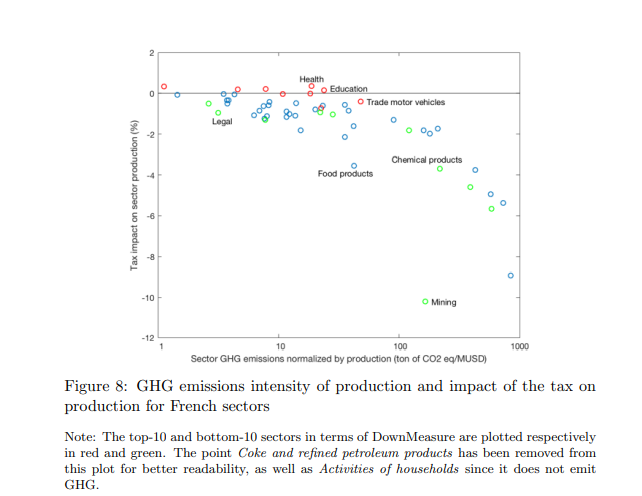
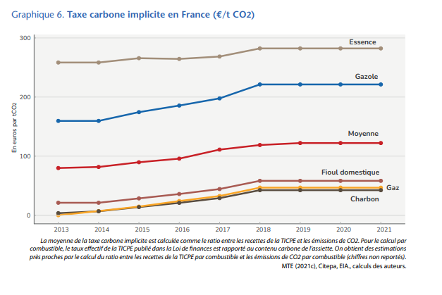
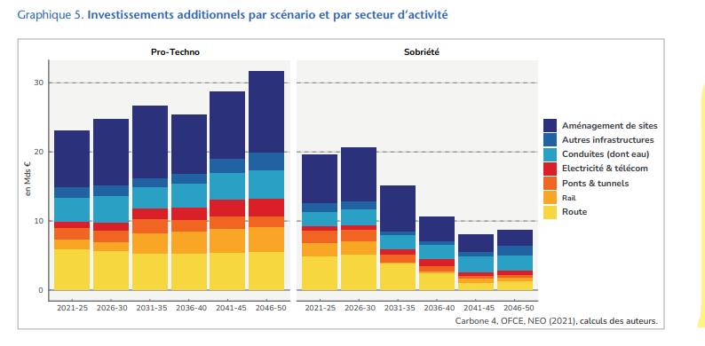

# Notes de lecture sur le sujet climat/carbone/environnement

## Avril 2022

**S. Tagliepietra:  *Fostering the Industrial Component of the European Green Deal: Key Principles and Policy Options* Intereconomics, Volume 56, 2021 · Number 6 · pp. 305–310**
[lien](https://www.intereconomics.eu/contents/year/2021/number/6/article/fostering-the-industrial-component-of-the-european-green-deal-key-principles-and-policy-options.html) 

> "The principles used by the new industrial policy approach to design policy interventions rest on the notion that the role of the state in industrial policy design must be that of identifying constraints and opportunities"
> 
> Green technologies are often still in the early stage or emerging, with higher levels of risk and uncertainty. In addition, green technologies seem to be more complex than non-green technologies and tend to have larger spillovers and affect a higher variety of other domains (Barbieri et al., 2020). The higher risks and uncertainty and the higher externalities from clean technologies make the case for a more directed approach aimed at supporting investments in clean technologies

références intéressantes sur green industrial policy: 
* Aghion, P., C. Hepburn, A. Teytelboym and D. Zenghelis (2019), Path dependence, innovation and the economics of climate change, in Handbook on Green Growth, Edward Elgar Publishing
* Altenburg, T. and D. Rodrik (2017), Green industrial policy: Accelerating structural change towards wealthy green economies, Green Industrial Policy.
* Hausmann, R., E. Fernández-Arias and U. Panizza (2020), Smart development banks, Journal of Industry, Competition and Trade, 20(2), 395-
* Kemp, R. and B. Never (2017), Green transition, industrial policy, and economic development, Oxford Review of Economic 

**Richard Tol: _Europe’s Climate Target for 2050: An Assessment_. Intereconomics, Volume 56, 2021 · Number 6 · pp. 330–335** [lien pdf](https://www.intereconomics.eu/contents/year/2021/number/6/article/europe-s-climate-target-for-2050-an-assessment.html#footnote-002-backlink)
> article de revue des objectifs climatiques de l'UE pour 2050. Affirme de manière provocative que le rapport coût-bénéfice de cet objectif est négatif. 
> pointe surtout du doigt les contradictions entre objectifs et moyens. Politique a plus de chance d'être efficace si UE est seule à s'engager. dans cas inverse risque d'être très coûteuse pour peu de résultats
> source de référence pour l'évaluation des incertitudes liées aux modèles et aux trajectoires

**Jean Pisani-Ferry:  *Climate Policy is Macroeconomic Policy, and the Implications Will Be Significant*. august 2021, PIEE policy brief** [lien pdf](https://www.piie.com/system/files/documents/pb21-20.pdf)
* estimations de commission Euro du plan climat : -0.7 à +0.55 % GDP à l'horizon 2030. but small aggregate changes at ten year horizon may conceal stronger disruption. 
* both pricing or regulation have effect of accelerating obsolescence of existing capital stock. decarbonization is adverse supply shock, of the same order of magnitude of oil shock of 1970s. 
* composition of growth will change: more investment, less consumption
* macroeconomic dimensions of climate actions have largely been overlooked
* transition to net zero invovlves a large negative supply shock : 3 points of 2019 world GDP
* transition implies net increase in investment of 2% (gross investment higher: divert investment from fossil fuel extraction). first order effect of consmption: 1% less consumption average per yer (10% in 2030). toll can reach 3% per year
* the net zero transition will likely push public finances further into debt

## Mars 2022

### publications repérées: 
* MTE/CGDD/CITEPA:  Prise en compte des émissions de GES dans les études d'impact [lien portail doc](http://portaildoc/exl-php/util/documents/accede_document.php?1648040840767)
* Misch, F. & Wingender, P. (2021): Revisiting Carbon Leakage. *IMF Working Paper* [link](https://www.imf.org/en/Publications/WP/Issues/2021/08/06/Revisiting-Carbon-Leakage-462148#:~:text=Summary%3A,propose%20innovations%20along%20two%20lines.)
 > This paper estimates the carbon leakage rate across countries, arguably a key parameter in the international climate policy discussion including on border carbon adjustment, but which remains subject to significant uncertainty. We propose innovations along two lines. First, we exploit recently published data on sector-country-specific changes in energy prices to identify changes in domestic carbon emissions and other flows (rather than the historically limited variation in carbon prices or adherence to international climate agreements). Second, we present a simple accounting framework to derive carbon leakage rates from reduced-form regressions in contrast to existing papers, thereby making our results directly comparable to model-based estimates of carbon leakage. We show that carbon leakage rates differ across countries and could be larger than what existing estimates suggest.

### papier lus:
**Antoine Devulder and Noëmie Lisack: Carbon Tax in a Production Network: Propagation and Sectoral Incidence. April 2020, WP #760** [lien pdf](https://publications.banque-france.fr/sites/default/files/medias/documents/wp760.pdf)

> **Abstract:** We analyse the propagation of carbon taxation through input-output production networks. To do so, we use a static multi-sector general equilibrium model including France, the rest of the European Union and the rest of the world to simulate the impact of carbon tax scenarios on economic activity. We find that a tax increase on sectors' and households' greenhouse gas emissions corresponding to a carbon price of 100 euros per ton of carbon dioxide equivalent entails a decrease in French aggregate real value added by 1.2% at a 5-to-10-year horizon when implemented in France only, vs. 1.5% when implemented in the whole EU. Impacts on sectoral real value added range from -20% to negligible. The most affected sectors are generally the most polluting ones, but the tax also propagates across sectors via intermediate inputs. Specifically, the network structure tends to affect comparatively more upstream sectors than downstream ones, given their taxation levels. International financial markets also play an important role by neutralizing the positive response of final demand that would result from the redistribution of the tax proceeds to domestic households.
> **Keywords:** Carbon tax, multi-sector model, international production networks

**principaux points d'intérêt**: 
* par rapport à d'autres modèles, absence de "double dividende". Cela vient de l'hypothèse de marchés parfaits à l'international => évite une appréciation du taux de change réel français
* modèle MRIO calibré. paramètres clé: élasticités de substitution: d'où viennent-elles? quelles sont leurs limites/incertitudes?
* lien de l'effet sectoriel avec le "downstreamness". calcule indices de "downstreamness" à la Antras & Chor (2013). D'une manière générale, les secteur downstream souffrent moins que les upstream de l'application d'une taxe. effet de substitution plus fort que la baisse de la demande. les secteurs upstream sont les plus touchés.

## Fevrier 2022

### Pastor, Stambaugh, Taylor (2021): Dissecting Green Returns. *Working Paper* [(pdf)](https://rodneywhitecenter.wharton.upenn.edu/wp-content/uploads/2021/11/StambaughTaylor_NovNewsletter.pdf)

exemple d'analyse de valeurs financières "vertes". L'excès de performance passée des valeurs vertes reflète un shift dans les préférences des investisseur, expansion du marché. 

> **Abstract** Green assets delivered high returns in recent years. This performance reflects unexpectedly strong increases in environmental concerns, not high expected returns. German green bonds outperformed their higher-yielding non-green twins as the “greenium” widened, and U.S. green stocks outperformed brown as climate concerns strengthened. To show the latter, we construct a theoretically motivated green factor—a return spread between environmentally friendly and unfriendly stocks—and find that its positive performance disappears without climate-concern shocks. A theory-driven two-factor model featuring the green factor explains much of the recent underperformance of value stocks. Our evidence also suggests small stocks underreact to climate news.
> 
> Keywords: Sustainable investing, ESG, environment, climate change, green bonds

### Reynès et al. (2022): Placer l'environnement au coeur de la politique économique

[Policy brief de l'OFCE n°100, 9 février 2022](https://www.ofce.sciences-po.fr/pdf/pbrief/2022/OFCEpbrief100.pdf)

points saillants: 
* taxation des carburants revient à un prix implicite du carbone de 300€/tCO2 => supérieur à niveau officiel / optimal
  + propose transparence sur les prix implicites comme voie d'acceptabilité sociale
  + exemptions minent l'acceptabilité sociale
* objectif neutralité carbone en 2050 > facteur 4
* émissions territoriales /hab: 6,3teqCO2 vs. moyenne euro 8 teqCO2
  + empreinte carbone 9,2teqCO2 en 2018
* budget carbone 2015-2018 dépassé de 3,5%
  + diminutions de 1,1% par an depuis 2015, vs. 1,9 nécessaire selon SNBC1
* scénarions ADEME et RTE et "évaluation" économique (double dividende, etc)
* besoins d'investissement
  + IDDRI/I4CE/IJD/OFCE : 13-15 Mds EUR inv pbq + privé supp par an de 2021 à 2023 (+0,7 pt PIB)
  + 1,2 pts PIB pour période suivante 2024-2028
  + Carbone4/OFCE/NEO, champ plus réduit : 4-4,8Mds EUR suppl/an. Investissement + importants dans scénario "pro-techno"

